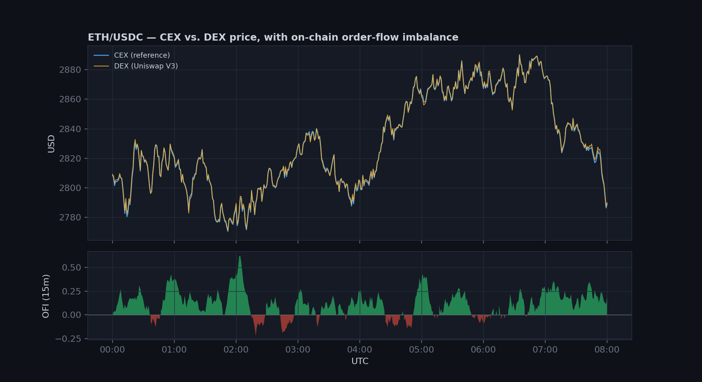
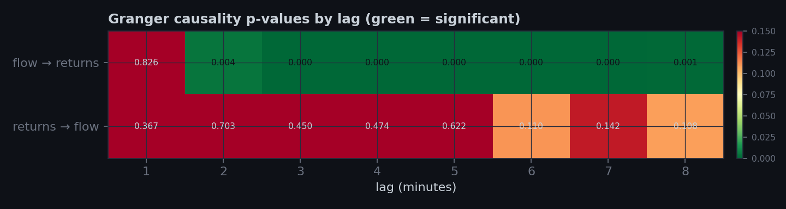

# On-Chain Order Flow and Price Discovery

A market microstructure study applying classical order-flow and cointegration
methods — Kyle (1985), Easley/Lopez de Prado/O'Hara VPIN, Engle-Granger,
MacKinlay event studies — to transaction-level DEX data instead of the
limit-order-book data those methods were originally built for.

The question: on-chain swap data makes every trade and every counterparty
address public in a way no traditional order book does. Does that
transparency translate into a measurable, tradeable signal — and if a
signal is statistically real, does it survive contact with realistic
transaction costs?

**[Read the results →](reports/research_note.md)**





## What's here

| Module | What it does |
|---|---|
| `src/data_sources/` | Uniswap V3 swap-log connector and CEX OHLCV connector (production interfaces; see note below), plus a calibrated synthetic generator used for local development |
| `src/signals/order_flow.py` | Order flow imbalance (OFI) and VPIN — the two standard order-flow toxicity measures, adapted from book-side to swap-side data |
| `src/econometrics/cointegration.py` | Engle-Granger test on the DEX/CEX pair, hedge ratio, OU half-life of the spread |
| `src/econometrics/granger.py` | Granger causality between order flow and returns, plus incremental-R² to separate statistical from economic significance |
| `src/econometrics/volatility.py` | GARCH(1,1)-t on returns, tested against on-chain activity as an exogenous variance regressor |
| `src/events/whale_events.py` | Event study (cumulative abnormal returns) around large single swaps |
| `src/backtest/engine.py` | Vectorized backtest with a minimum-holding-period rule and a cost-sensitivity sweep |
| `src/viz/` | Chart styling and the figure set used in the research note |

```
python run_analysis.py
```
regenerates everything in `reports/` from scratch (data → signals →
econometrics → event study → backtest → figures + note), on a fresh synthetic
draw each run.

## Why synthetic data

A working Uniswap V3 + CEX pipeline needs an RPC endpoint (Alchemy/Infura),
an Etherscan key for address labeling, and exchange API access — none of
which are available in the environment this was built in. Rather than skip
the data layer, `src/data_sources/synthetic.py` generates a minute-bar
dataset with the same statistical shape a live feed would have: a
GARCH(1,1) reference price, a mean-reverting DEX/CEX basis, and swap flow
with a partially-informed component that leads price by construction (see
the module docstring for the exact mechanism).

This makes two things possible before a single API key is configured:
building and unit-testing the full signal/econometrics/backtest stack, and
having a known ground truth to validate the pipeline against — if the
Granger test doesn't pick up an effect that was deliberately injected, the
pipeline has a bug, not an uninteresting dataset. `src/data_sources/onchain.py`
and `cex.py` are the real implementation targets; swapping them in only
requires matching the column schema documented in `synthetic.py`.

**The numbers in `reports/research_note.md` describe this synthetic sample,
not live markets.** The point of the repo is that the methodology is sound
and the pipeline runs end to end — re-running it against real logs is the
actual empirical test, not a formality.

## Setup

```bash
pip install -r requirements.txt
python run_analysis.py
```

To point at live data instead: set `ETH_RPC_URL` (Alchemy/Infura) and
implement the log-decoding step in `src/data_sources/onchain.py` (the
event topic and ABI fragment are already there), then swap the
`synthetic.load_dataset()` call in `run_analysis.py` for
`onchain.fetch_pool_flow()` + `cex.fetch_ohlcv()`.

## Next steps

- Validate against a real Uniswap V3 pool (WETH/USDC 0.05% tier is the
  natural first target — deep liquidity, tight CEX-DEX basis)
- Multi-pool panel instead of a single pair, to test whether the flow→return
  relationship is asset-specific or a general microstructure feature
- Replace the flat-bps cost assumption in the backtest with an actual
  constant-product slippage model plus gas cost per swap
- Out-of-sample split once real data covers more than one volatility regime

## References

- Kyle, A. (1985). *Continuous Auctions and Insider Trading.* Econometrica.
- Easley, D., López de Prado, M., & O'Hara, M. (2012). *Flow Toxicity and
  Liquidity in a High-Frequency World.* Review of Financial Studies.
- Engle, R., & Granger, C. (1987). *Co-integration and Error Correction.*
  Econometrica.
- MacKinlay, A.C. (1997). *Event Studies in Economics and Finance.* Journal
  of Economic Literature.
- Barbon, A., & Ranaldo, A. (2021). *On the Quality of Cryptocurrency
  Markets: Centralized Versus Decentralized Exchanges.*
